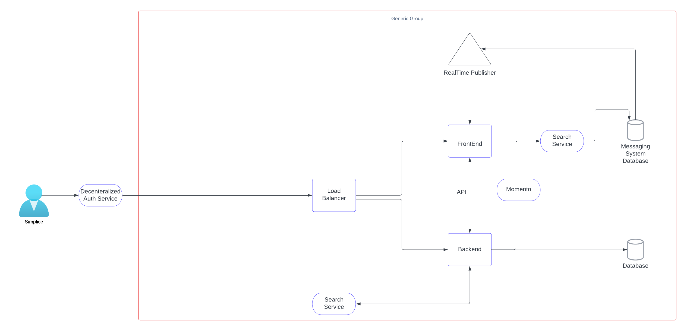
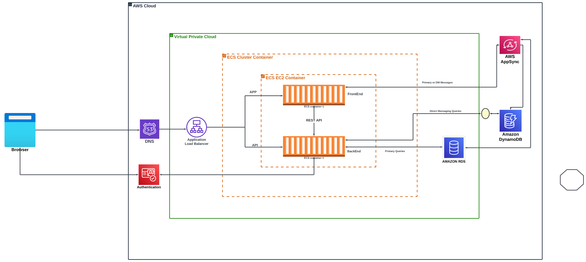
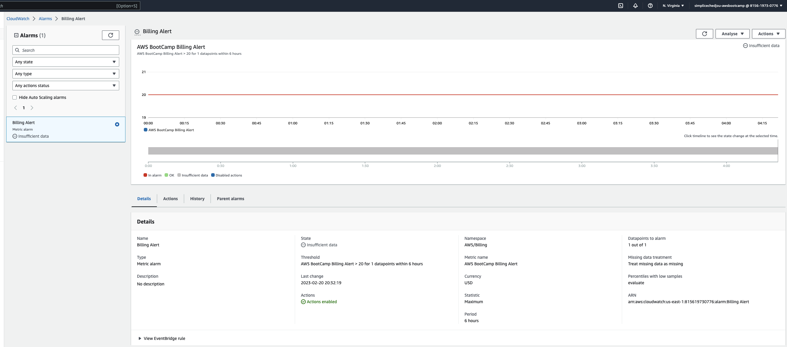
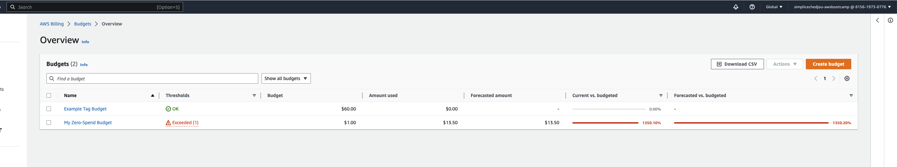

### Week 0 — Billing and Architecture
---
## Link to Lucy Chart Diagrams
---
- Link to my Lucid Chart  [conceptiual diagram](https://lucid.app/lucidchart/f975a1ef-9921-4f43-b2e4-8a83696c19f5/edit?viewport_loc=-2842%2C-1972%2C1560%2C2013%2C0_0&invitationId=inv_b505625c-f043-4f79-a368-bcee26e0fbb0)
- Link to my Lucid Chart [logical-diagram](https://lucid.app/lucidchart/f975a1ef-9921-4f43-b2e4-8a83696c19f5/edit?viewport_loc=-3708%2C-732%2C10552%2C4316%2CzD4zn84TSDaI&invitationId=inv_b505625c-f043-4f79-a368-bcee26e0fbb0)
---
##  Diagrams images
---

---

---
## Budget and alarm images
---

---

