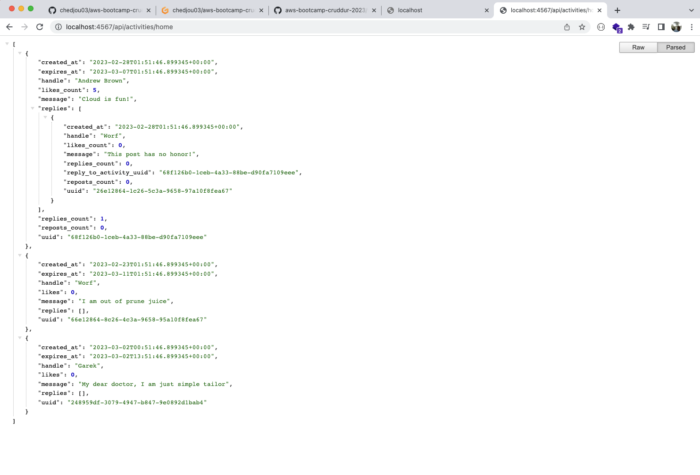
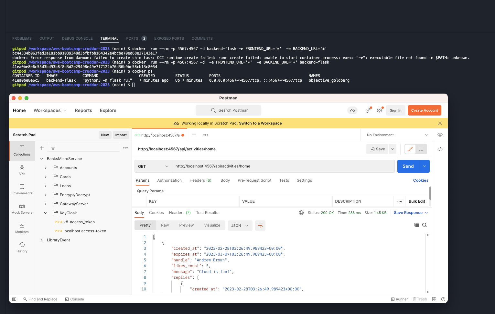
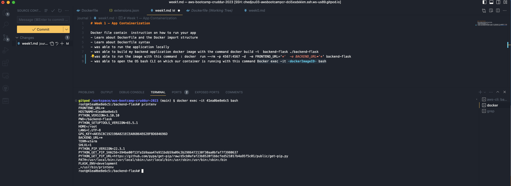
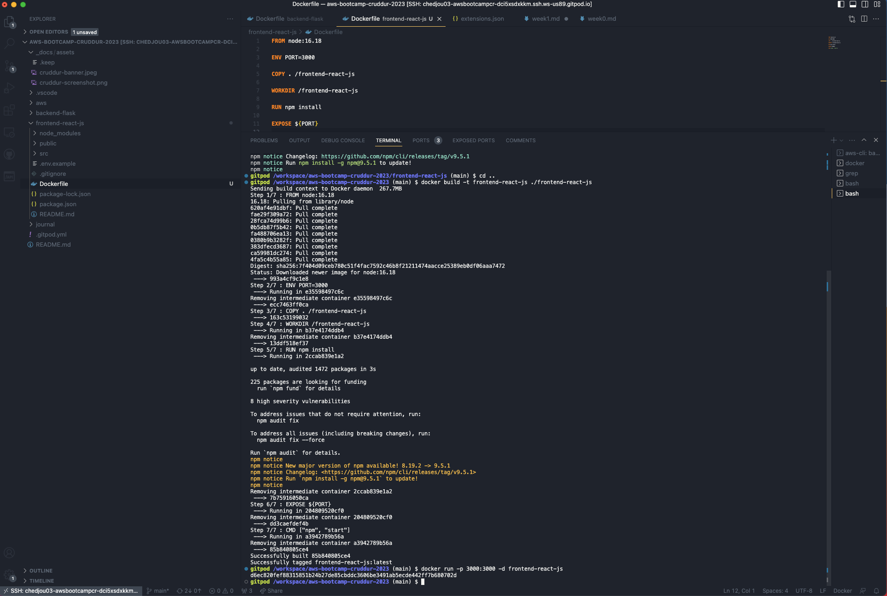
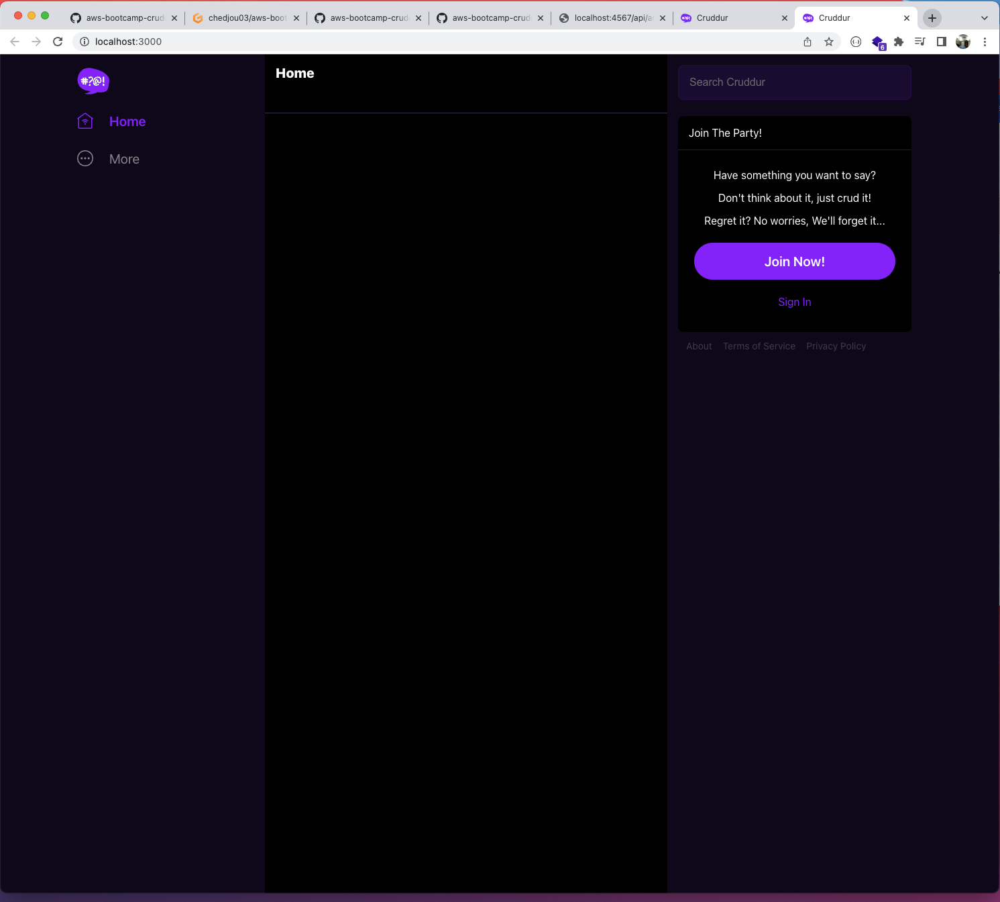
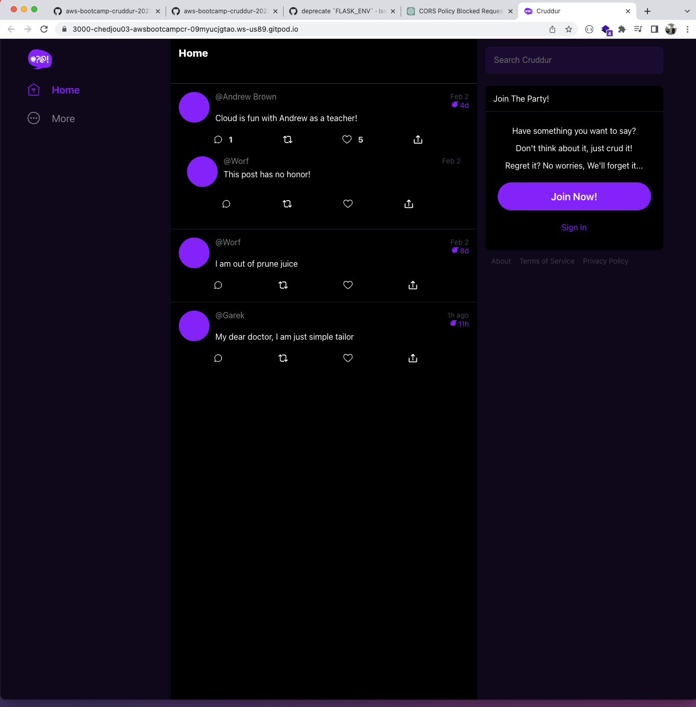
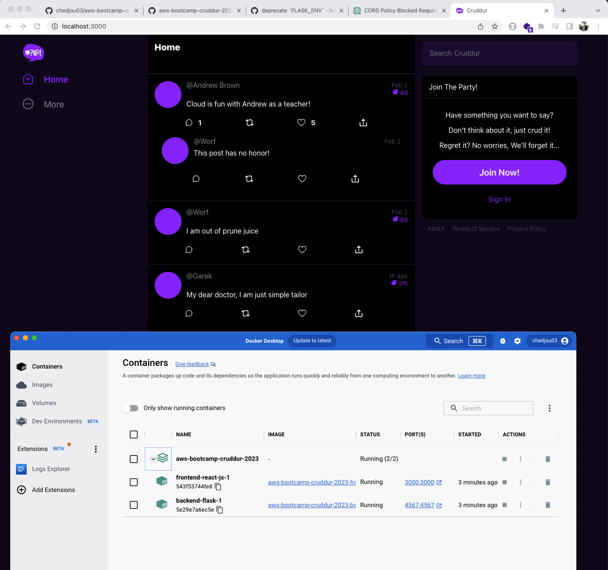
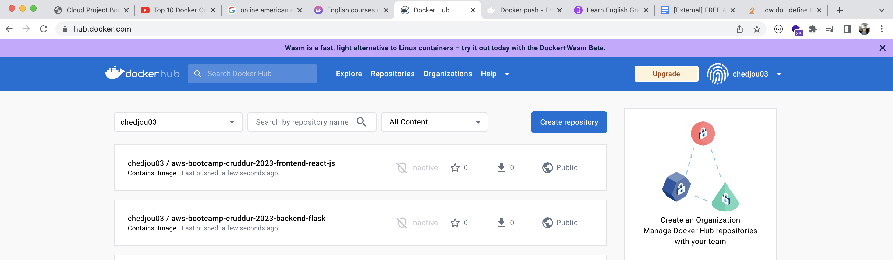
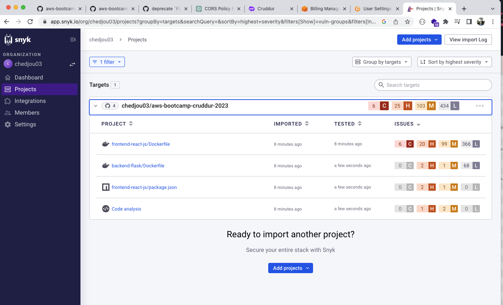
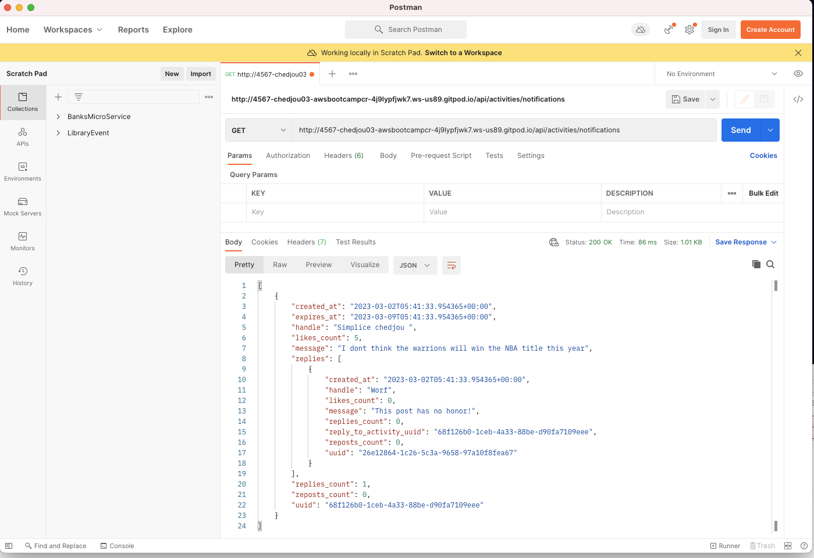

# Week 1 — App Containerization

Docker file contain  instruction on how to run your app 
- Learn about DockerFile and the Docker import structure
- Learn about Dockerfile syntax
- was able to run the application locally 
- was able to build my backend application docker image with the command docker build -t  backend-flask ./backend-flask 
- was able to run the image with this command  : docker  run --rm -p 4567:4567 -d  -e FRONTEND_URL='*'  -e BACKEND_URL='*' backend-flask
- was able to open the OS bash CLI on which our container is running with this command Docker exec -it <dockerImageID> bash
- learn and run multiple docker like docker ps : docket logs : docker ps -a : docker stop 
- learn how to write and run a docker compose file on gidPod workspace
- underdant the container orchestration
- was able to install and run docker locally
- was able to run the compose command locally 
- run cruddud frontend and backend run locally
- push my frontend and backend docker images to my docker Hub
- Learn how to use Snyk to scan my application for images vulnerabilities
- I was able to implement the notification endpoint in the backend
- I was able to add the frontend notification page and hooks it to the backend
 

---
##  Screenshot images
---

- Application running locally

---

- Build Docker image - run container

---

- see env-var-in-the-container-OS

---

- build-frontend-docker-image-and-run-it

---

- frontend-running

---

- cruddur-frontend-backend

 ---

- cruddud-frontend-backend-running-locally

 
---

- cruddud-frontend-backend-images-on-dockerHub

  
---

- Snyk-project-scan

---

- backend-notifications

