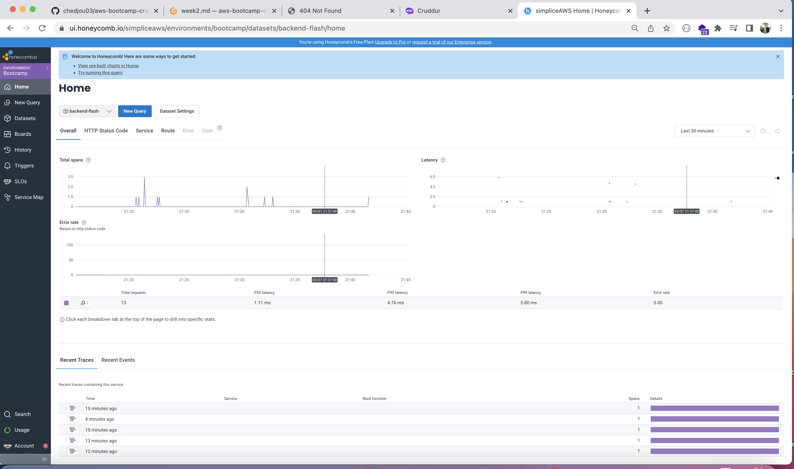
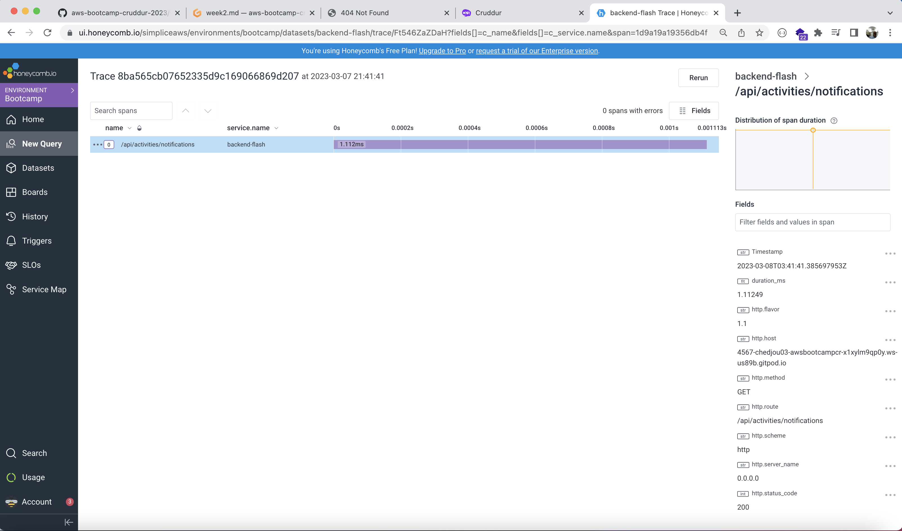
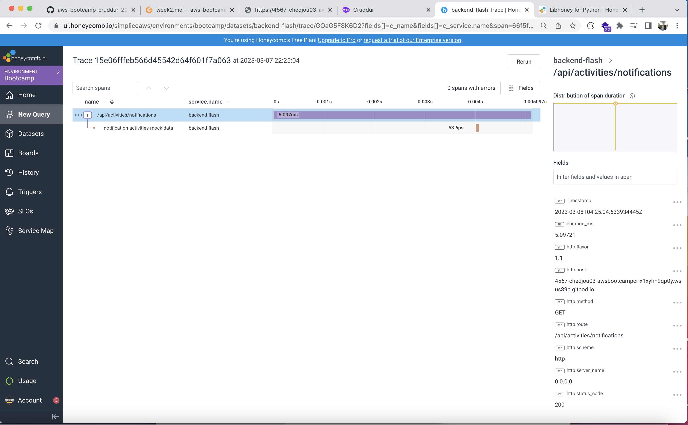
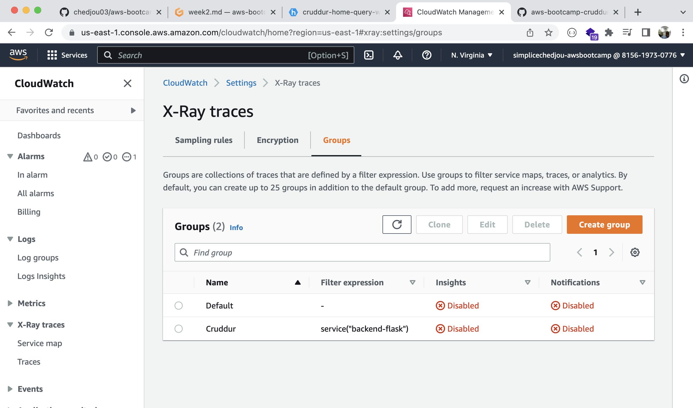
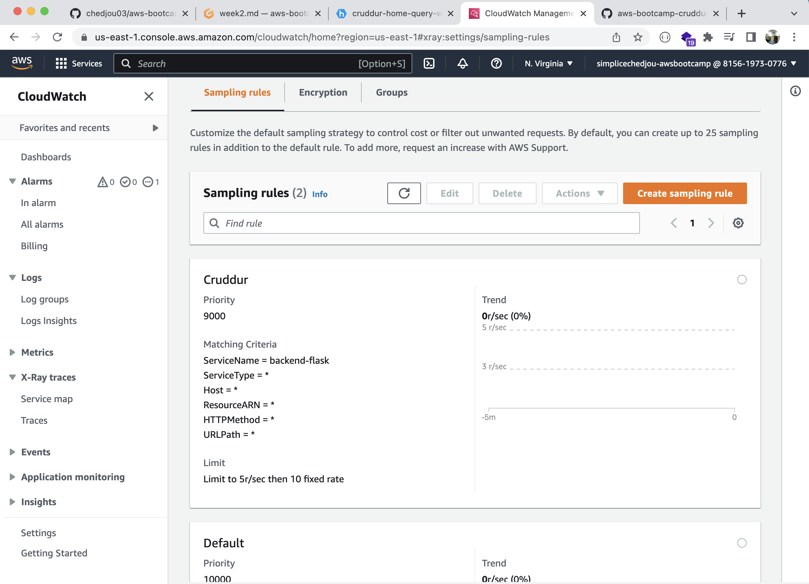
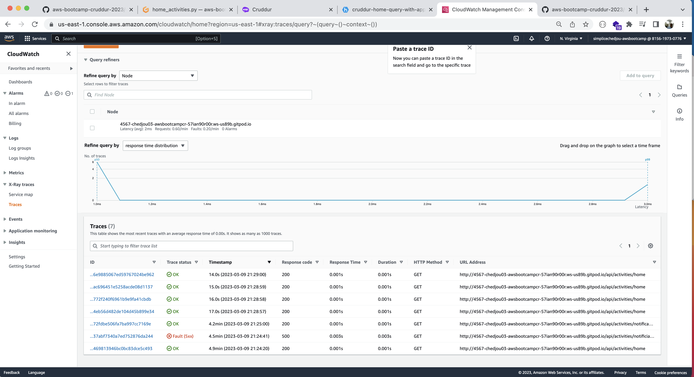
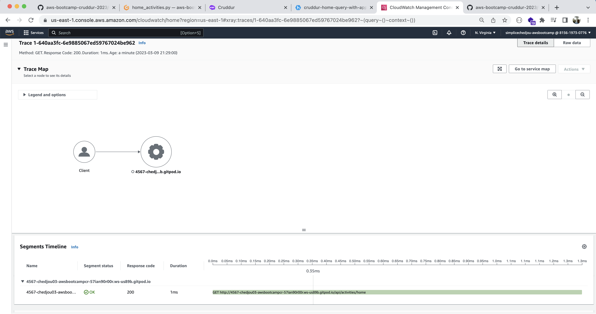

# Week 2 — Distributed Tracing

- Was able to configure my application to send log to Honeycomb
- Configure my Gidpod yml file so that port used by frontend and backend are automatically opened
- was able to add a span to my notification and home honeycomb trace
- was able to create a z-ray log group and a sampling rules
- was able to have backend flask send log to aws x-ray
- was able to see logs in aws cloudwatcxh x-ray

---
##  Screenshot images

- honeycomb-cruddur-backend-logs

---

- honeycomb-trace

---

- honeycomb-notificatin-span

---

- x-ray-log-group

---

- x-ray-sampling-rules

---

- aws-x-ray-logs-list

---

- aws-x-ray-trace

