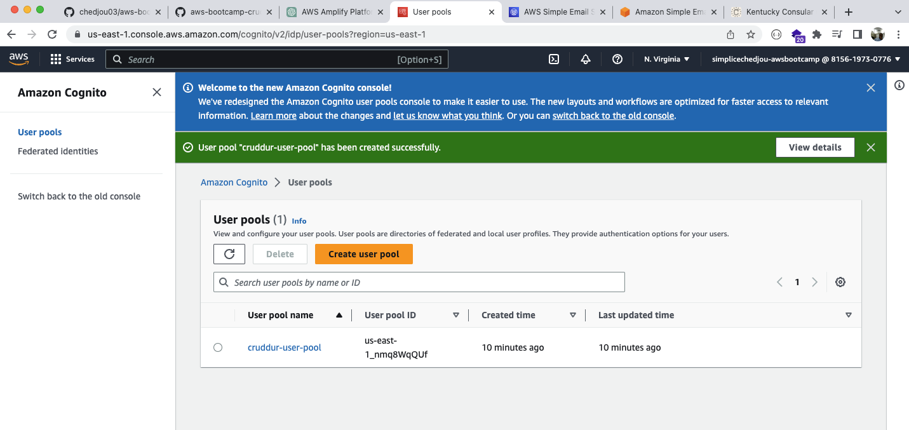
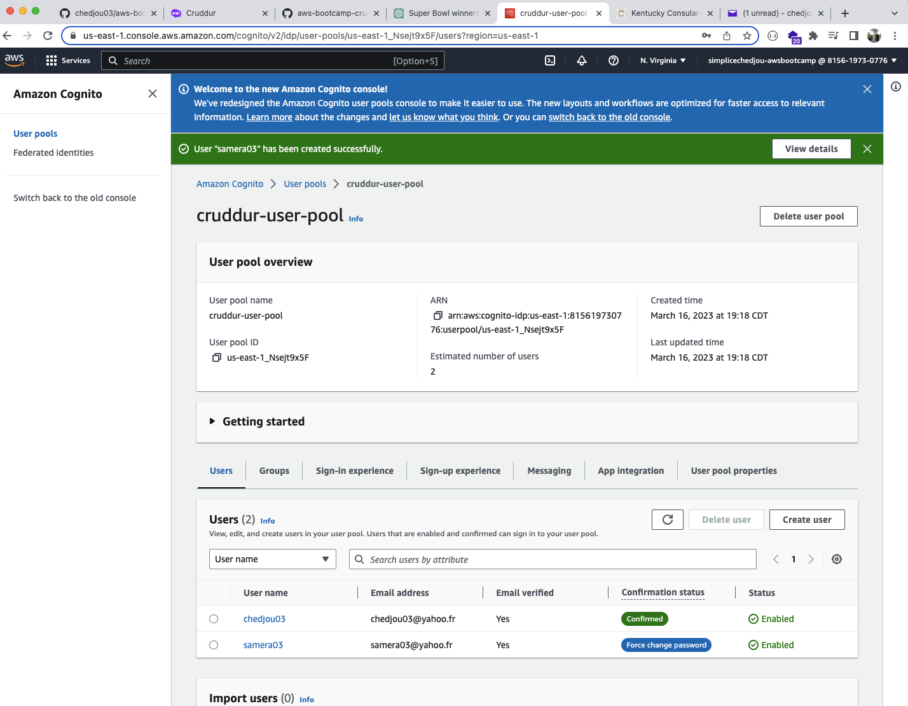
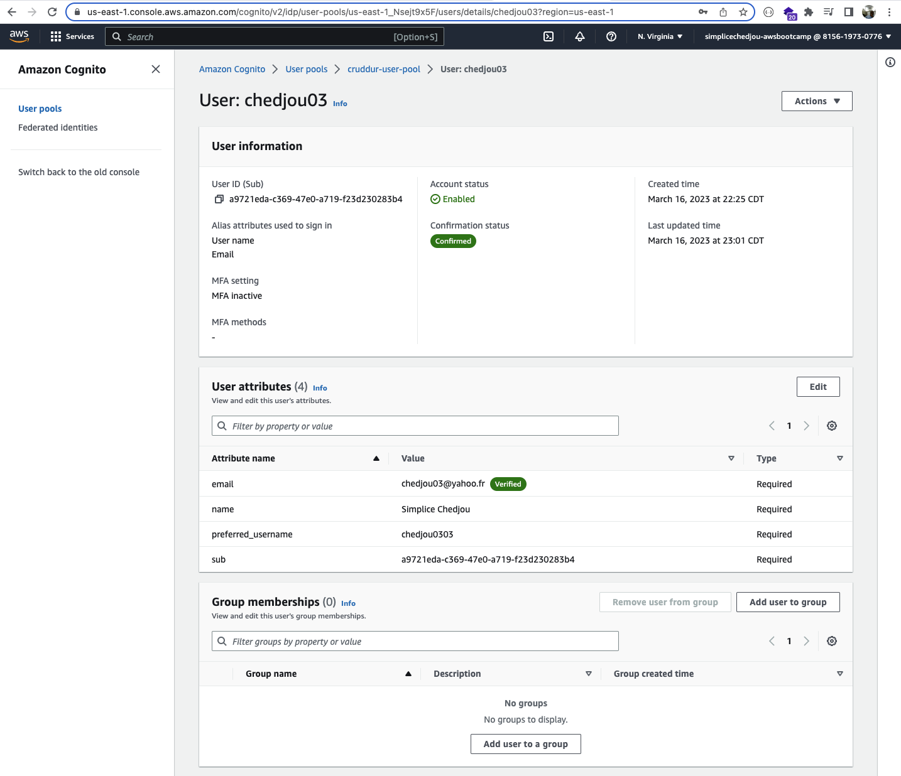
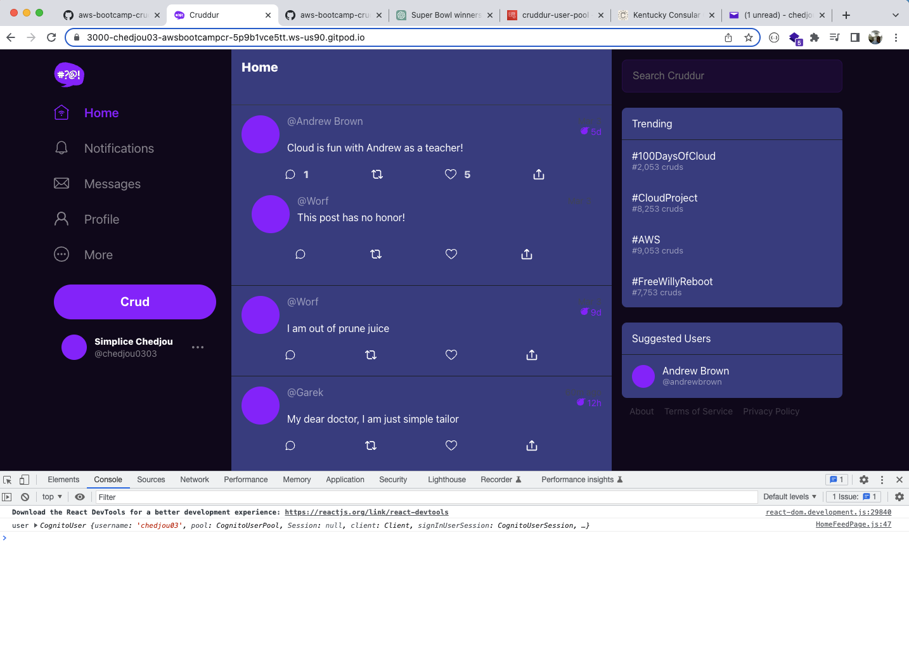
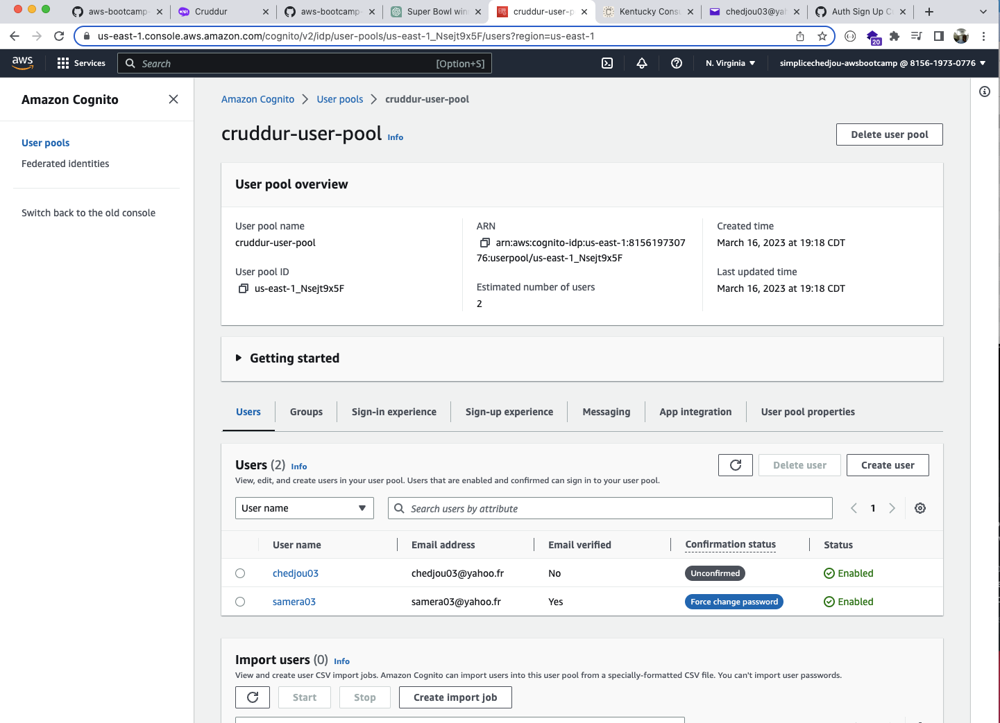
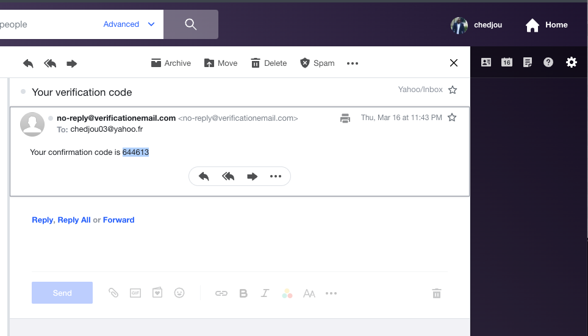
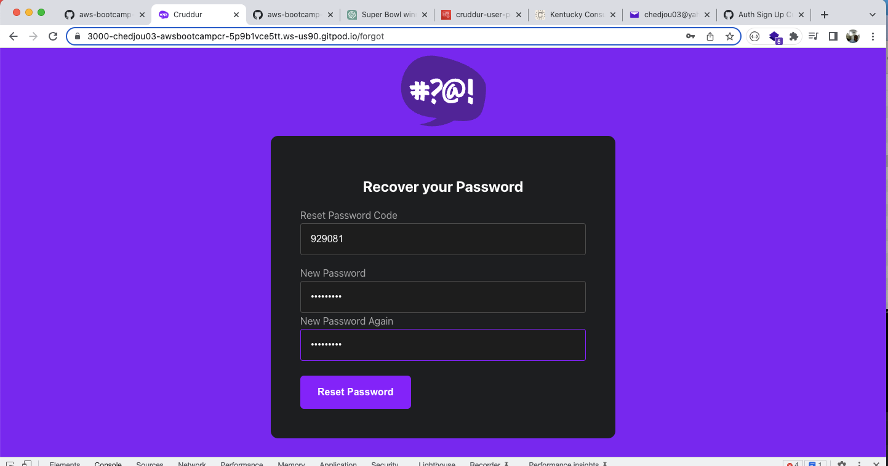
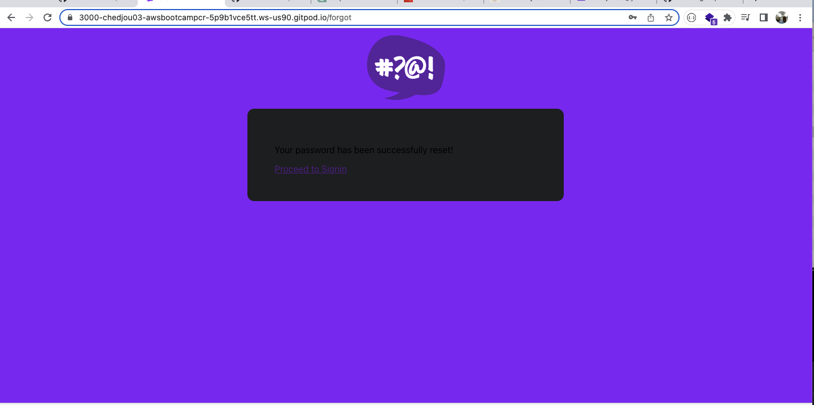
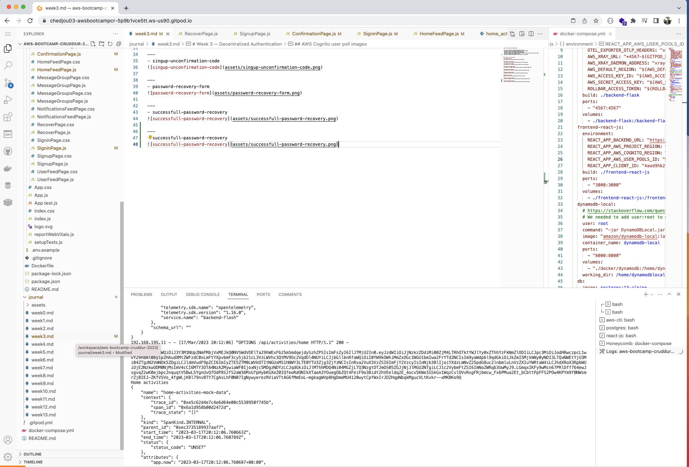

# Week 3 — Decentralized Authentication

- was able to create and configure my AWS cognito suer pool 
- was able to use AWS CLI to update cognito user status to confirmed 
- was able to log into cruddur with the AWS cognito user
- was able to sign up a user throught crudder sign up page
- was able to confirm a user throught the cruddur confirmation page with the code recieved by email
- was able to implemente the password recovery
- was able to pass the access_token from the frontend to the backend

---
##  AWS Cognito user poll images

- aws-cognito-user-pool

---
- aws-cognito-user-confirmed

- aws-cognito-user-confirmed1

---
- aws-cognito-user-logged-cruddur

---
- aws-cognito-unconfirmed-user

---
- singup-unconfirmation-code

---
- password-recovery-form

---
- successfull-password-recovery

---
- access-token-backend
