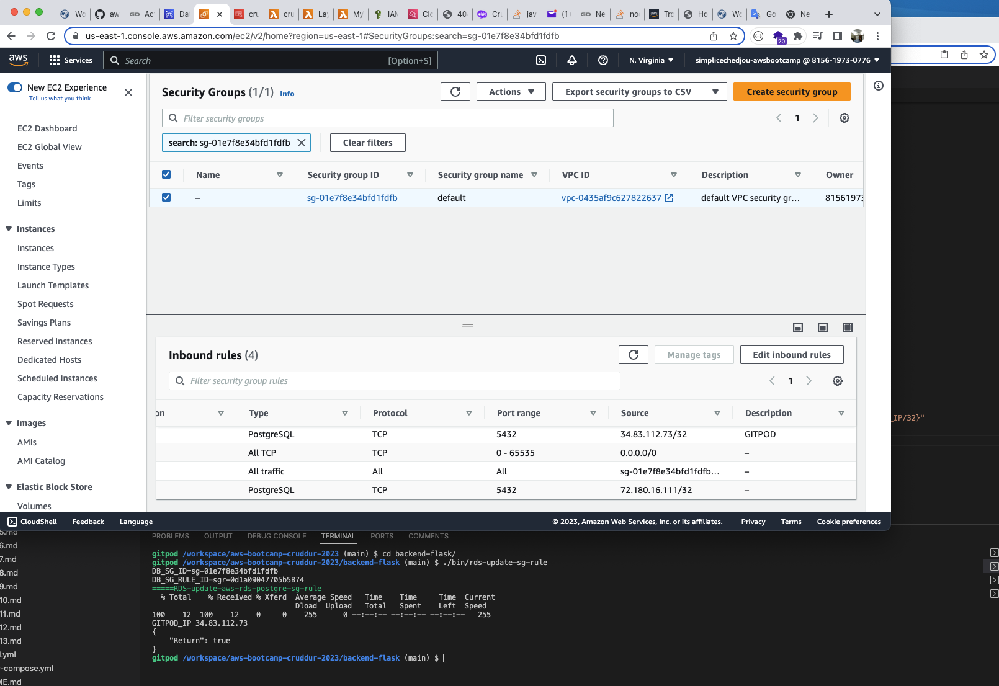
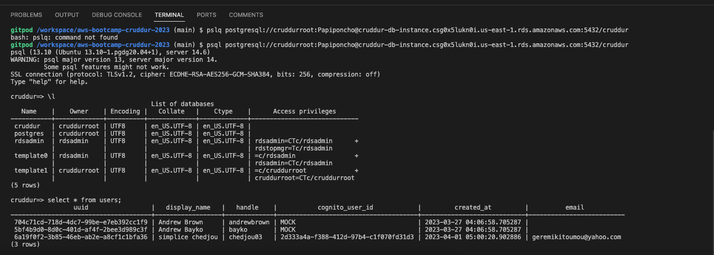
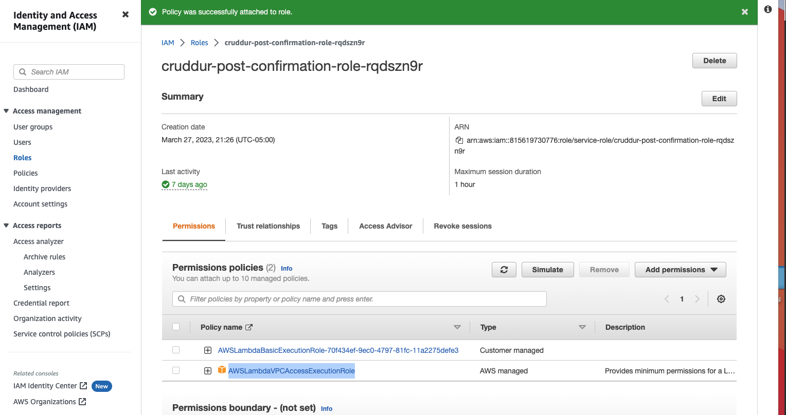
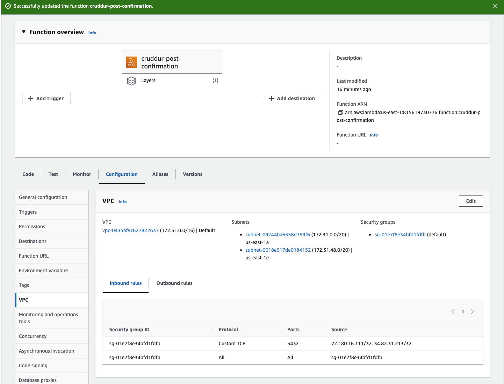
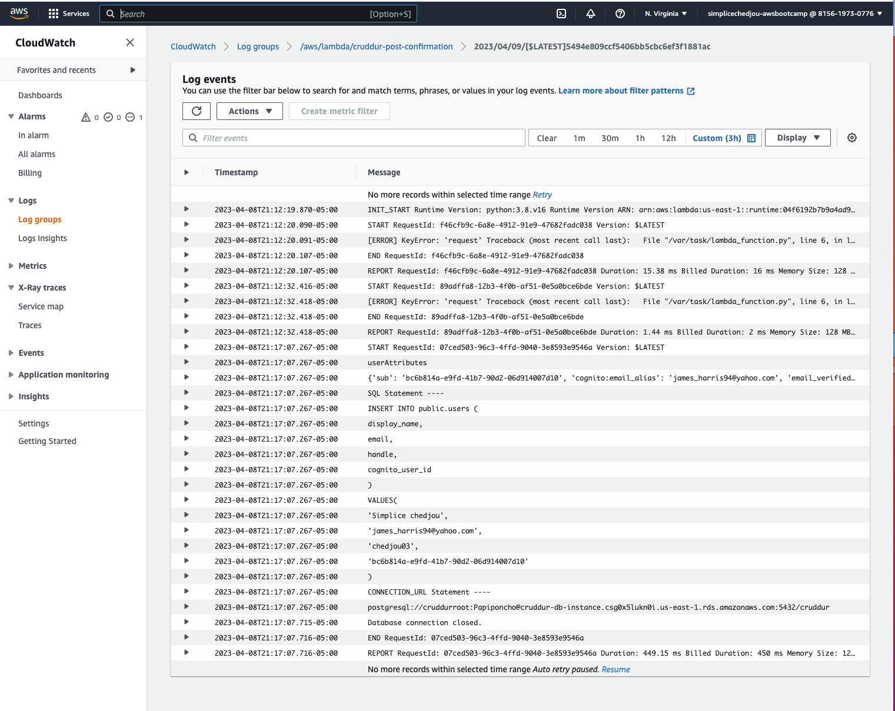

# Week 4 — Postgres and RDS

- was able to use AWS CLI to create a postgree RDS  
- was able to define and run create database, drop database, load data sql script
- was able to output color of the echo comand when running db script  
- was able to run the schema load and seed sql script 
- was able to have the home activities UI component read data from local postgre DB
- was able to connect to AWS protgree DB in gitpod CLI
- was able to dynamically update the aws postgre DB security group inbound rule IP address
- was able to write a script to dynamically update the postgre DB security group inbound rule IP address
- was able to have my lambda function update the the user table with the new enrolled user send through cognito


---
##  AWS Postgree RDS

- aws-postgre-RDS


---
##  SHELL SCRIPT ECHO colo change 

- shell-echo-color


---
##  DATA in Activities and users table 

- data-activities-user-table


- data-user-table


---
##  view data imported from seed data in a UI 

- data-imported-from-seed-in-ui


---
##  Script to dynamically update the RDS inbound security group 

here is the code that when run, will get the new gitpod env IP address and updade the RDS security group that controle the inbound traffic
``` shell
#! /usr/bin/bash

# Define color variables
GREEN='\033[0;32m'
NC='\033[0m' # No Color

export DB_SG_ID="sg-01e7f8e34bfd1fdfb"
gp env DB_SG_ID="sg-01e7f8e34bfd1fdfb"

export DB_SG_RULE_ID="sgr-0d1a09047705b5874"
gp env DB_SG_RULE_ID="sgr-0d1a09047705b5874"

echo -e "${GREEN}=====RDS-update-aws-rds-postgre-sg-rule${NC}"

GITPOD_IP=$(curl ifconfig.me)

echo GITPOD_IP $GITPOD_IP 

aws ec2 modify-security-group-rules \
    --group-id $DB_SG_ID \
    --security-group-rules "SecurityGroupRuleId=$DB_SG_RULE_ID,SecurityGroupRule={Description=GITPOD,IpProtocol=tcp,FromPort=5432,ToPort=5432,CidrIpv4=$GITPOD_IP/32}"
```
- updated-scurity-group



---
##  Lambda fuction to insert new user in RDS table 

had this lamda function attached to my cognito user pole, that will be run every time a new user in confirmed in our user pool. the purpose of that lambda function is to insert the newly confirm user in the rds users table.
in order for my lambda funtion to accesst my RDS, I have to got attached this IAM policy "AWSLambdaVPCAccessExecutionRole" to the role attached to my lambda, so that my lambda could have access to all the ressource within mu VPC, and I also have to add my lambda fucton to the same VPC, subnet as my RDD 

``` python
import json
import psycopg2
import os

def lambda_handler(event, context):
    user = event['request']['userAttributes']
    print('userAttributes')
    print(user)

    user_display_name  = user['name']
    user_email         = user['email']
    user_handle        = user['preferred_username']
    user_cognito_id    = user['sub']
    try:
     
      sql = f"""
         INSERT INTO public.users (
          display_name, 
          email,
          handle, 
          cognito_user_id
          ) 
        VALUES(
          '{user_display_name}', 
          '{user_email}', 
          '{user_handle}', 
          '{user_cognito_id}'
        )
      """
      print('SQL Statement ----')
      print(sql)
      print('CONNECTION_URL Statement ----')
      print(os.getenv('CONNECTION_URL'))
      conn = psycopg2.connect(os.getenv('CONNECTION_URL'))
      cur = conn.cursor()
      cur.execute(sql)
      conn.commit() 

    except (Exception, psycopg2.DatabaseError) as error:
      print(error)
    finally:
      if conn is not None:
          cur.close()
          conn.close()
          print('Database connection closed.')
    return event

```
- insert-newly-confirmed-user-in-rds


- lambda-access-to-vpc-ressource


- lambda-vpc


- lambda-cloudwatchlog



