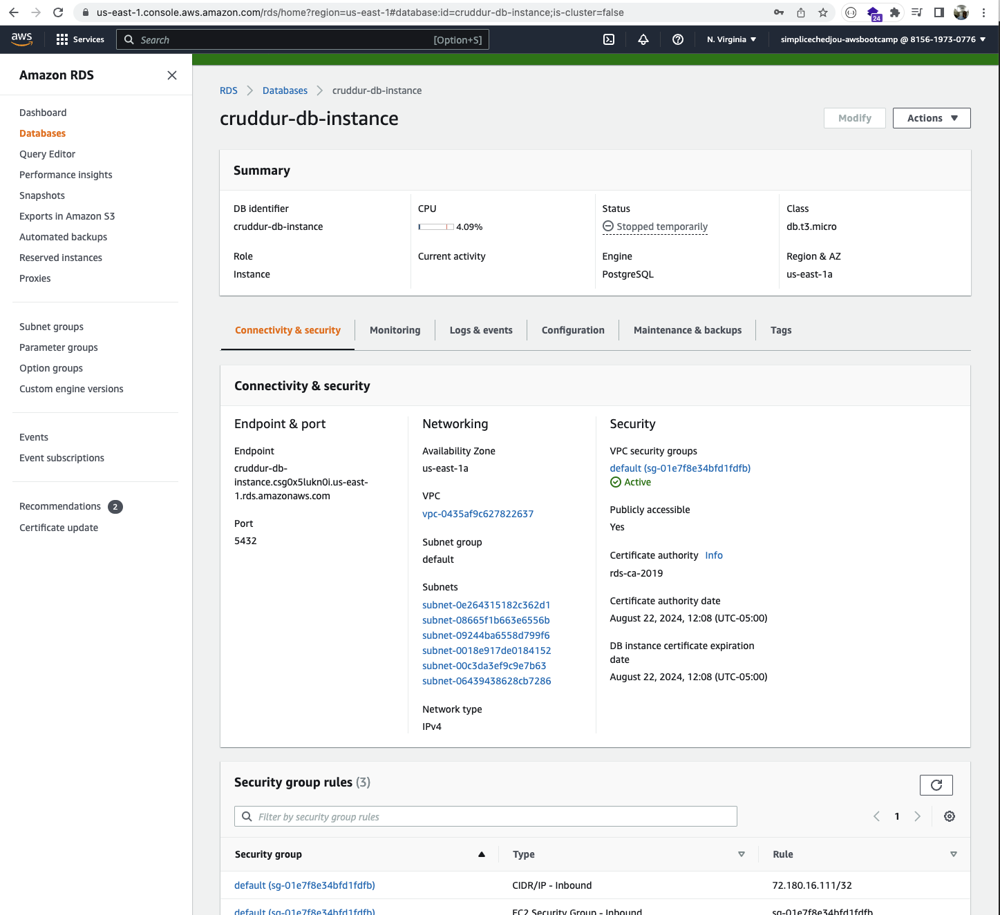
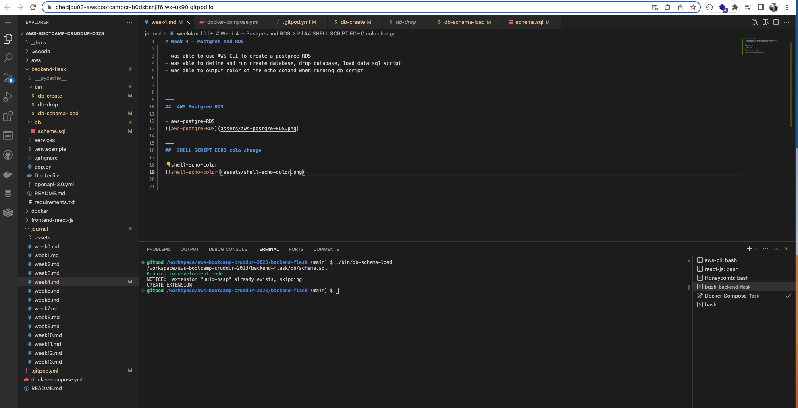
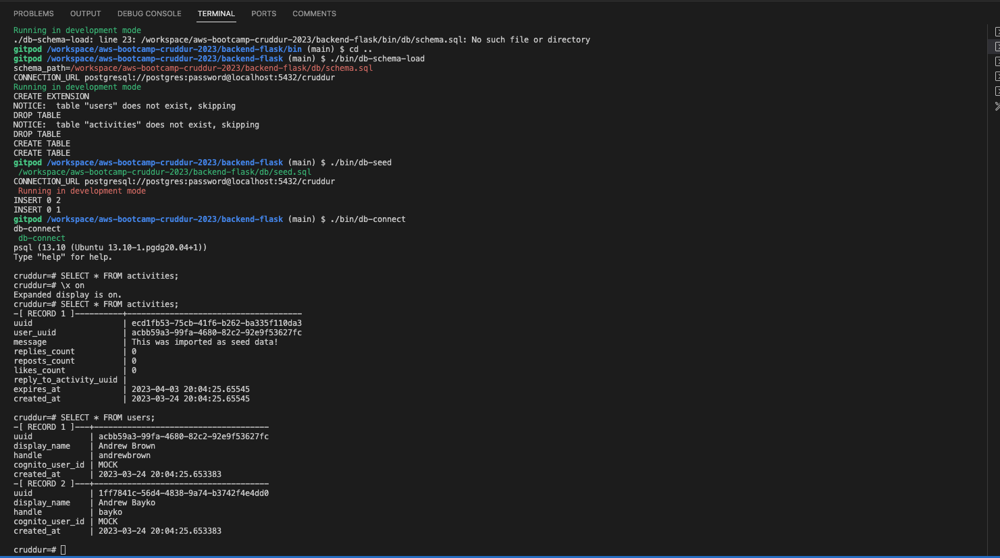
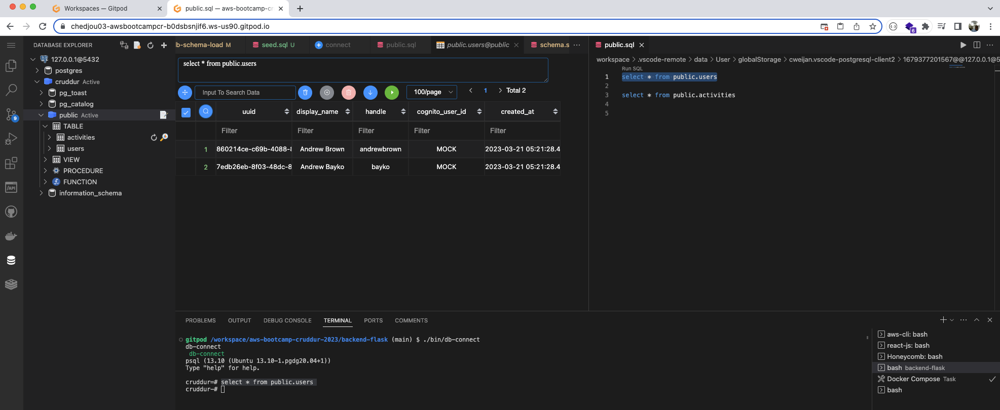
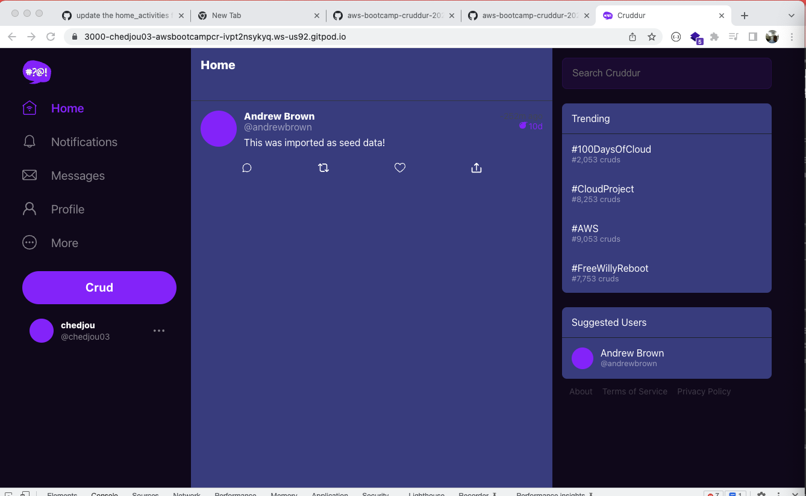

# Week 4 — Postgres and RDS

- was able to use AWS CLI to create a postgree RDS  
- was able to define and run create database, drop database, load data sql script
- was able to output color of the echo comand when running db script  
- was able to run the schema load and seed sql script 
- was able to have the home activities UI component read data from local postgre DB

---
##  AWS Postgree RDS

- aws-postgre-RDS

---
##  SHELL SCRIPT ECHO colo change 

- shell-echo-color

---
##  DATA in Activities and users table 

- data-activities-user-table

- data-user-table

---
##  view data imported from seed data in a UI 

- data-imported-from-seed-in-ui

